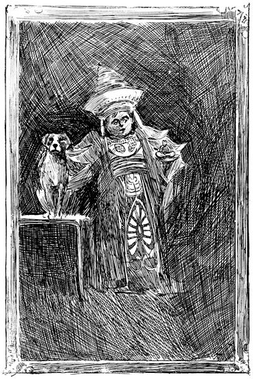

# سفر شگفت‌انگیز بارون ترامپ به اعماق زمین

## جلد اول



---

### مشخصات کتاب

**نویسنده:** اینگرسول لاک‌وود  
**تصویرگر:** چارلز هاوارد جانسون  
**تاریخ انتشار:** ۱۸۹۲  

---

### یادداشت زندگینامه‌ای

دربارهٔ ویلهلم هاینریش سباستین فون تروپ، که معمولاً بارونِ کوچکِ ترامپ خوانده می‌شود:

از آنجا که به نظر می‌رسد آدم‌های شکاک در همهٔ موقعیت‌ها سر برمی‌آورند، شاید خوب باشد که در این مورد خاص جلوی آنها را بگیریم و ثابت کنیم که بارون ترامپ یک بارون واقعی بود، نه فقط یک بارون خیالی. اصل این خانواده به هوگنوهای فرانسوی — دو لا ترومپ — بازمی‌گردد که پس از لغو فرمان نانت در سال ۱۶۸۵ به هلند پناه بردند و در آنجا سرِ خانواده نام خود را به وان در تروپ تغییر داد، همان‌طور که بسیاری از پروتستان‌های فرانسوی نام‌های خود را به هلندی برگرداندند. چند سال بعد، به دعوت انتخاب‌کنندهٔ براندنبورگ، نیکلاس وان در تروپ تابع آن شاهزاده شد و املاک بزرگی در استان پومرانیا خرید و باز هم نام خود را تغییر داد، این بار به فون تروپ.

«بارونِ کوچک» که به خاطر قامت کوتاهش چنین نامیده می‌شد، در اواخر سدهٔ هفدهم به دنیا آمد. او آخرین بازماندهٔ خاندان خود در خط مستقیم بود، هرچند پسرعموهایش امروزه جزء اشراف معروف پومرانیا هستند. او سفرهای خود را در سنی باورنکردنی آغاز کرد و قلعه‌اش را چنان با اشیای شگفت و بی‌مانند که از گوشه و کنار دنیا جمع کرده بود، پر کرد که دهقانان ساده‌دل او را نیمه‌دانا و نیمه‌جادوگر می‌پنداشتند — از این رو افسانه‌ها و داستان‌های تخیلی بسیاری دربارهٔ این جهان‌گرد خستگی‌ناپذیر شکل گرفت. تاریخ مرگ او به درستی مشخص نیست؛ اما می‌توان گفت که در میان پرتره‌های مشاهیر پومرانیایی که در تالار شهر اشتتین آویزان است، تصویری وجود دارد که مردی با قامت کوتاه و سری بسیار بزرگ‌تر از بدنش را نشان می‌دهد. آن مرد لباسی شگفت و بی‌مانند پوشیده و در دست چپش مجسمه‌ای ظریف از عاج، با کنده‌کاری‌های بسیار دقیق، دارد. چهره‌ی پهن او سرشار از هوش است و چشمان درشت خاکستری‌اش با نگاهی خوش‌طبع و طعنه‌آمیز که بی‌اختیار جلب توجه می‌کند، روشن شده‌اند. دست راستش بر پشت سگی قرار دارد که روی میزی نشسته و با وقاری به بیرون خیره شده که نشان می‌دهد می‌داند دارد برای پرتره‌اش ژست می‌گیرد.

اگر بازدیده‌ای از راهنما بپرسد که این مرد کیست، همیشه پاسخ می‌شنود: — «اوه، این بارونِ کوچک است!» اما بارونِ کوچک کیست؟ این سوال است. چرا نمی‌تواند همان ویلهلم هاینریش سباستین فون تروپ معروف باشد که معمولاً «بارونِ کوچکِ ترامپ» و سگ شگفت او بولگر نامیده می‌شود؟

---

### فهرست مطالب

| فصل | عنوان |
|-----|-------|
| [Chapter اول](chapters/Chapter%20اول.md) | بولگر از صمیمیت سگ‌های دهکده و گستاخی گربه‌های خانه به شدت آزرده می‌شود |
| [Chapter دوم](chapters/Chapter%20دوم.md) | دستورالعمل‌های مرموز دون فوم |
| [Chapter سوم](chapters/Chapter%20سوم.md) | ایوان بیش از پیش مزاحم می‌شود |
| [Chapter چهارم](chapters/Chapter%20چهارم.md) | زخمم بهبود می‌یابد |
| [Chapter پنجم](chapters/Chapter%20پنجم.md) | بالا و باز هم بالاتر، و از میان معدن‌های دیوها |
| [Chapter ششم](chapters/Chapter%20ششم.md) | ناامیدی من از اینکه لولهٔ قیف برای بدنم بسیار کوچک است |
| [Chapter هفتم](chapters/Chapter%20هفتم.md) | اولین شب ما در جهان زیرین |
| [Chapter هشتم](chapters/Chapter%20هشتم.md) | صبح‌بخیر تا وقتی که ادامه دارد |
| [Chapter نهم](chapters/Chapter%20نهم.md) | بولگر و من به ملکه گالاکسا معرفی می‌شویم |
| [Chapter دهم](chapters/Chapter%20دهم.md) | گفتگوهایم با دکتر نِبِیولوسوس، سر امبر اوپِیک و لرد کُرنوکور |
| [Chapter یازدهم](chapters/Chapter%20یازدهم.md) | روزهای خوشی که در میان میکا-منکی‌ها گذراندیم |
| [Chapter دوازدهم](chapters/Chapter%20دوازدهم.md) | داستان غم‌انگیز شاهزاده‌خانمِ داغ‌دیده |
| [Chapter سیزدهم](chapters/Chapter%20سیزدهم.md) | چگونه دست به کار شدم تا اشتباهی را جبران کنم |
| [Chapter چهاردهم](chapters/Chapter%20چهاردهم.md) | بولگر و من پشت به قلمروی زیبای ملکه کریستالینا می‌کنیم |
| [Chapter پانزدهم](chapters/Chapter%20پانزدهم.md) | نگهبانان دروازه‌ی نقره‌ای |
| [Chapter شانزدهم](chapters/Chapter%20شانزدهم.md) | عقاید فرمی-فولک دربارهٔ دنیای بالایی ما |
| [Chapter هفدهم](chapters/Chapter%20هفدهم.md) | ساعت زنگ‌دار زنده و حمام‌کننده سودو-پسی |
| [Chapter هجدهم](chapters/Chapter%20هجدهم.md) | تاریخچهٔ اولیهٔ سودو-پسی‌ها |
| [Chapter نوزدهم](chapters/Chapter%20نوزدهم.md) | آواز خاموش انگشتان‌خوان |
| [Chapter بیستم](chapters/Chapter%20بیستم.md) | چگونه پوتینگ-لیپ عزیز گم شد |
| [Chapter بیست و یکم](chapters/Chapter%20بیست%20و%20یکم.md) | در مسیر خود در رودخانهٔ تاریک و خاموش روشنایی یافتیم |
| [Chapter بیست و دوم](chapters/Chapter%20بیست%20و%20دوم.md) | کاخ یخی در نور طلایی خورشید |
| [Chapter بیست و سوم](chapters/Chapter%20بیست%20و%20سوم.md) | باز هم لرد داغ‌سر |
| [Chapter بیست و چهارم](chapters/Chapter%20بیست%20و%20چهارم.md) | شاهزاده‌خانم کوچک و دوست‌داشتنی شنی‌بوله |
| [Chapter بیست و پنجم](chapters/Chapter%20بیست%20و%20پنجم.md) | شبی بی‌خوابی برای بولگر و من |
| [Chapter بیست و ششم](chapters/Chapter%20بیست%20و%20ششم.md) | چگونه سنگ‌تراشان شاه گِلیدوس زندان بلورین را شکافتند |
| [Chapter بیست و هفتم](chapters/Chapter%20بیست%20و%20هفتم.md) | هیجان بر سر فوف‌کوجا |
| [Chapter بیست و هشتم](chapters/Chapter%20بیست%20و%20هشتم.md) | چگونه یک بار کوچک ممکن است به بار سنگینی تبدیل شود |
| [Chapter بیست و نهم](chapters/Chapter%20بیست%20و%20نهم.md) | مطلبی دربارهٔ دروازه‌های متعدد به قلمروی یخی |
| [Chapter سی‌ام](chapters/Chapter%20سی‌ام.md) | هولناک‌ترین اما باشکوه‌ترین سواری که در عمرم کردم |
| [Chapter سی و یکم](chapters/Chapter%20سی%20و%20یکم.md) | غارهای باشکوه مرمر سفید |
| [Chapter سی و دوم](chapters/Chapter%20سی%20و%20دوم.md) | چگونه وارد سرزمین فراموش‌کاران خوشبخت شدیم |

---

### ساختار پروژه

این مخزن شامل ترجمهٔ فارسی مجموعه کتاب‌های «سفر شگفت‌انگیز بارون ترامپ» است.

```
trump-journeys/
├── volume-01/          # جلد اول: سفر به اعماق زمین
│   ├── README.md       # این فایل - معرفی جلد اول
│   ├── images/         # تصاویر جلد اول
│   └── chapters/       # فصل‌های جلد اول (32 فصل)
├── volume-02/          # جلد دوم (در آینده)
├── volume-03/          # جلد سوم (در آینده)
└── README.md           # معرفی کلی مجموعه (در حال تکمیل)
```

---

### دربارهٔ این ترجمه

این کتاب الکترونیکی از پروژه گوتنبرگ تهیه شده و به فارسی ترجمه شده است.

**توجه:** متن اصلی این اثر تحت قوانین کپی‌رایت ایالات متحده محافظت نمی‌شود و توزیع آن آزاد است.
